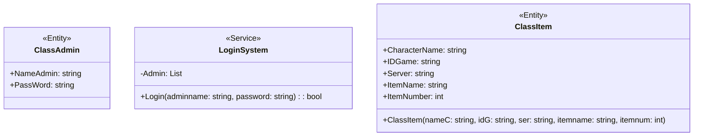
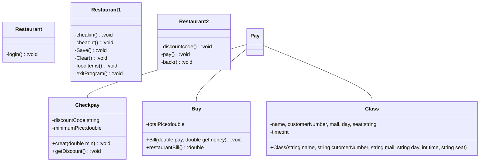

# OOPFinalProject-653450279-6

ความเป็นมาของโปรแกรม
 - เกิดจากการที่เพื่อนคนหนึ่งที่เป็นพ่อค้าในเกมๆหนึ่งที่ต้องมีการจดไอเท็มในเกมอยู่เสมอ

วัตถุประสงค์ของโปรแกรม
 - มีวัตถุประสงค์ในการทำให้โปรแกรมนี้เป็นโปรแกรมในการจดบึนทึก รายการ Item ภายในเกมๆหนึ่ง (ขอไม่บอกชื่อเกม เพราะเขาไม่ได้จ่าย)

โครงสร้างของโปรแกรม (Class diagram) Mermaid 

ชื่อของผู้พัฒนาโปรแกรม
 - นายกฤตชวกร ชวลิตกิตติวงศ์ รหัสนักศึกษา 653450279-6
